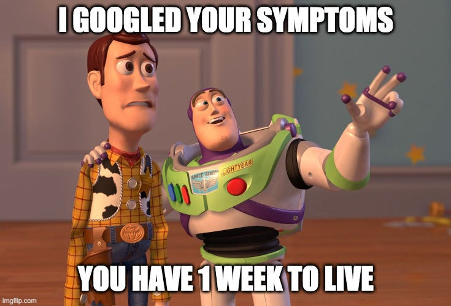
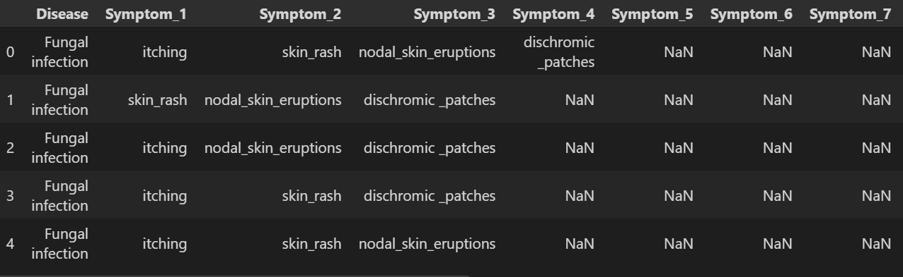
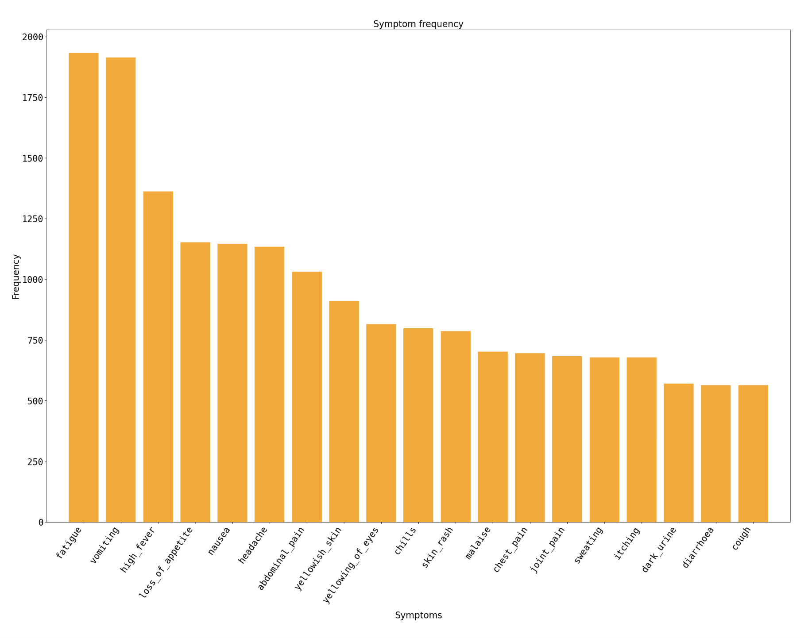
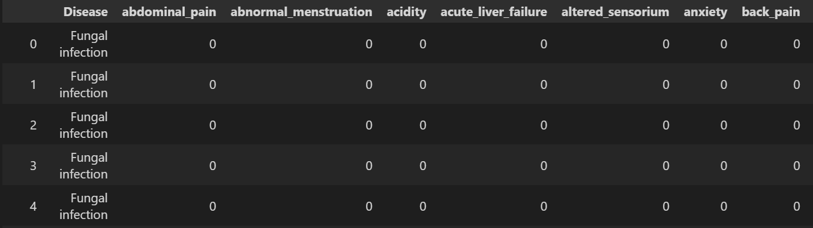
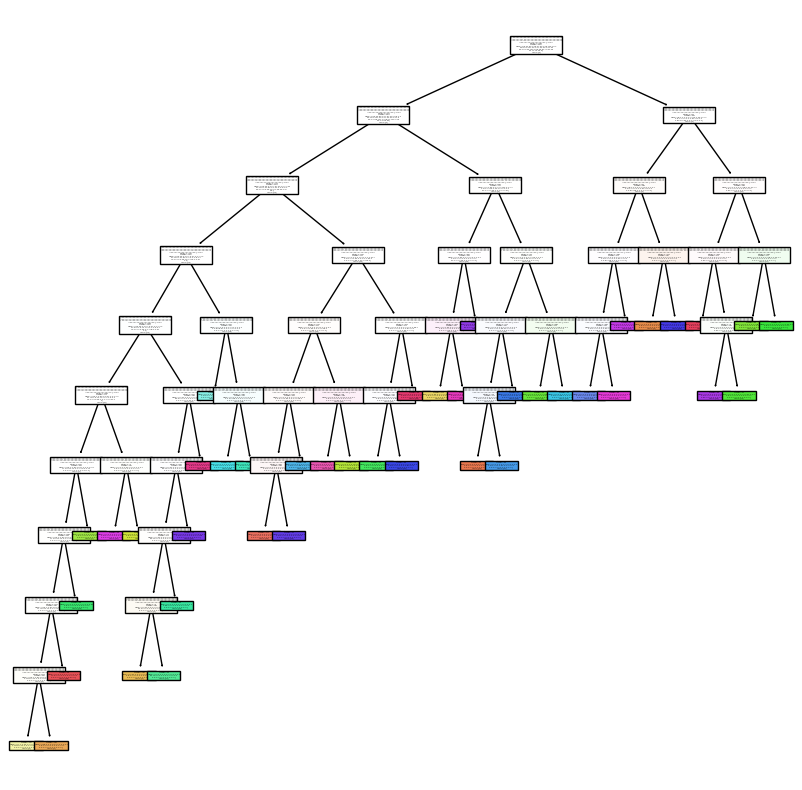

# Barbie : You Can Be A Doctor!

## Mark: The content in this repo is copied from Barbie-Data-Dive organization which is funded by Jacquelin Lai and Lara Terpetschnig, the content within the repo is also created by Jacquelin Lai and Lara Terpetschnig.

## File Directory

*LICENSE* - license for free use and reproduction of code   
*README.md* - guide to the dataset and the code   
*dataset.csv* - dataset used in code   
*project.html* - html file containing code   
*project.ipynb* - python file containing code   

## Background:

It is common for people to look up their symptoms when they are experiencing pain, swelling, redness, or any other concerning symptom. Studies show that over 90% of patients Google their symptoms before talking to a doctor ([source](https://www.huffpost.com/entry/how-to-google-health-symptoms_l_622919c4e4b0317d0a2b7c40#:~:text=Surveys%20suggest%20about%2090%25%20of,a%20real%20and%20troubling%20phenomenon)). However, people frequently joke that Google’s diagnosis is often much more serious than their present condition. This is because Google makes suggestions based on what other people have searched, even if they are searching for rare diseases that you are unlikely to have. Furthermore, most people click on the first result, which may not lead to an accurate or trustworthy site. It is important for healthcare practitioners to develop alternate methods for diagnosing patients in the digital age, especially since Google “rabbit holes” can cause anxiety and exacerbate conditions like Cyberchondria, which manifests itself as obsessive online searching about potential ailments ([source](https://pubmed.ncbi.nlm.nih.gov/29324396/)).

## Mission

Goal 1: To accurately predict a disease given the symptoms experienced in a way that is more reliable than using a search engine.     
Goal 2: To create a classifier that can assist doctors and other medical practitioners in the complicated task of patient diagnosis.

## Dataset

We used a dataset from Kaggle which contains information about the symptoms experienced by people with a certain disease. The dataset is linked [here](https://www.kaggle.com/datasets/itachi9604/disease-symptom-description-dataset?select=dataset.csv). There are a total of 41 diseases and 131 unique symptoms in the dataset.

*Disease* - the disease that the patient was diagnosed with    
*Symptom_ 1 to Symptom_17* - the symptoms that the patient experienced, with 17 being the greatest possible amount

The most common symptoms are as follows:

## Data Cleaning

We reshaped the data to be comprised of columns with binary values, representing whether or not a symptom was experienced in tandem with a disease. This allows us to utilize machine learning models.

## Results

K-nearest-neighbors - The accuracy of the model is **0.675**.

Decision tree -  The accuracy of the model is **0.866**.
| Parameter Type     | Model Selection |
| ----------- | ----------- |
| cost complexity      | 0.03       |
| criterion for split   | entropy        |
| maximum depth of tree | 10 levels |
| maximum features to be considered | 70 features |

The tree is visualized below:

Random forest - The accuracy of the model is approximately* **0.89**.
| Parameter Type     | Model Selection |
| ----------- | ----------- |
| cost complexity      | 0.03       |
| criterion for split | log_loss |
| maximum dept of tree | 5 levels |
| maximum features to be considered | 20 features |
| number of trees | 7 |

*the accuracy fluctuates slightly every time the code is run

## Conclusion

The model with the highest accuracy is the Random Forest model. It has the potential to be utilized in a healthcare setting to help predict a patient's possible illness in an accurate and timely manner. Rather than seeking to replace healthcare workers, this model can and should be used with a human “in-the-loop” as the results from machine learning and human knowledge are much more accurate and powerful when combined ([source](https://www.ncbi.nlm.nih.gov/pmc/articles/PMC10328041/)).

## Future Work

Our predictions are limited by the diseases that we have included in the dataset, so in the future, we could expand this dataset to allow for more diseases to be accurately predicted. We could also create an app so that our results will be more accessible to the general public.
